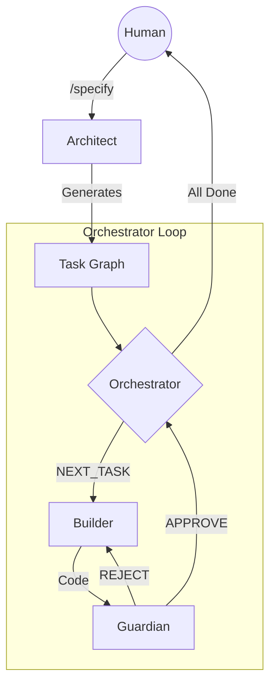

# Agentic OS v5.0: The Constitutional Swarm Architecture

**Status:** Draft (Operation Renaissance)
**Date:** 2026-02-09

## 1. Core Philosophy: Spec-Driven Graph Execution
Traditional "chain of thought" scripts are replaced by a **Task Graph Engine**.
- **Input:** `spec.md` (Human Intent).
- **Process:** The Orchestrator "explodes" the spec into a Directed Acyclic Graph (DAG) of tasks.
- **Rules:** Every edge transition in the graph is governed by the **Constitution**.

## 2. Directory Structure (The Hardware)

### `src/orchestrator/` (The Kernel)
- `main.ts`: The entry point. Handles CLI args and initializes the Swarm.
- `graph_engine.ts`: Manages task dependencies (DAG).
- `context_manager.ts`: Holds the "Short-Term Memory" (STM) of the current run.

### `src/agents/` (The Workers)
Each agent is a class implementing `IAgent`.
- **Architect (`agents/architect.ts`)**:
    - *Role:* Turns Spec -> Graph.
    - *Tools:* RAG (Query ADRs), Plan Generator.
- **Builder (`agents/builder.ts`)**:
    - *Role:* Turns Task -> Code.
    - *Tools:* FileSystem, Compiler, Linter.
- **Guardian (`agents/guardian.ts`)**:
    - *Role:* Turns Code -> Verdict.
    - *Tools:* ATDI Calculator, Security Scanner.
- **Sociologist (`agents/sociologist.ts`)**:
    - *Role:* Turns Team Interaction -> Optimization.
    - *Tools:* Communication Log Analysis.

### `src/core/memory/` (The Hippo/Campus)
- `adr_manager.ts`: Long-Term Memory (LTM). Stores decisions.
- `vector_db.ts`: (Future) Embedding storage for semantic search.

## 3. The Execution Loop (The Software)

## 4. Key Innovations (v5.0)
1.  **Closed-Loop Correction:** The *Guardian* can reject a task and send it back to the *Builder* with specific feedback (e.g., "Cyclic Dependency in `AuthService`") without human intervention.
2.  **Context Injection:** Before the *Builder* writes code, the *Orchestrator* injects relevant ADRs from `src/core/memory` into the prompt.
3.  **Sovereign Logging:** Every tool call and state change is signed and logged to `flight_recorder.json` for ISO 42001 audit.
