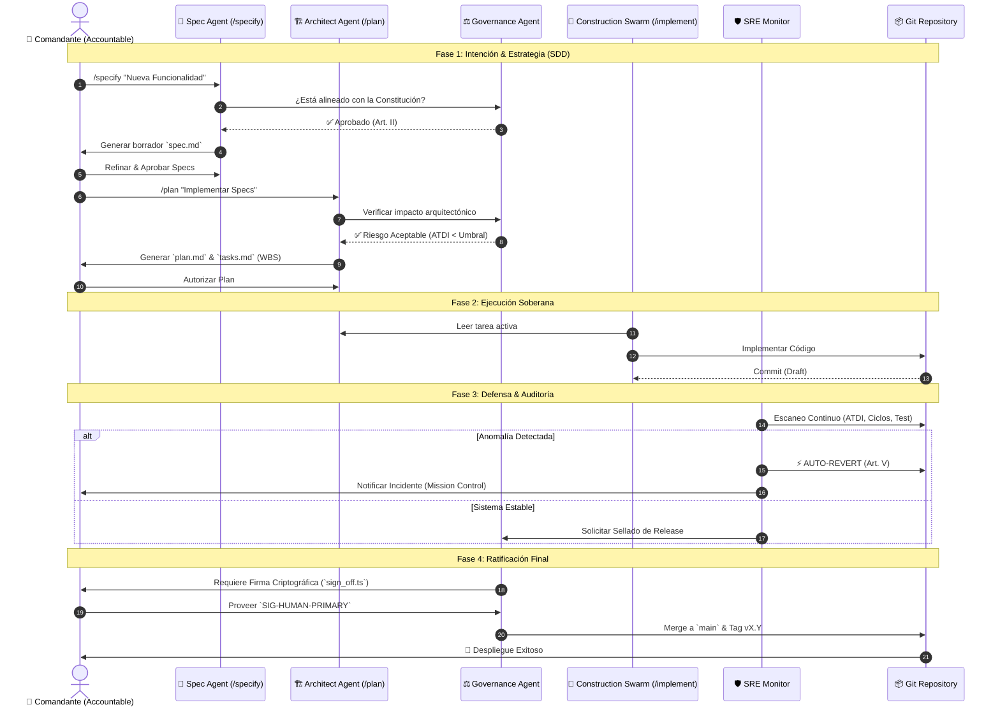

# Mapa de Flujo de Valor (VSM): Sovereign SDLC Pipeline

Este diagrama ilustra el flujo "End-to-End" de una intención humana a través de la arquitectura soberana, destacando los puntos de control de gobernanza y las defensas automatizadas.

## Leyenda de Componentes
1.  **Gobernanza (Gov)**: El "Portero" que consulta la `constitution.md`.
2.  **SRE (Shield)**: El sistema inmunológico que revierte cambios tóxicos automáticamente.
3.  **Accountable (Human)**: El único con autoridad para firmar el despliegue final (Art. I).
