# Mapa de Flujo de Valor (VSM): Sovereign SDLC Pipeline

Este diagrama ilustra el flujo "End-to-End" de una intención humana a través de la arquitectura soberana, destacando los puntos de control de gobernanza y las defensas automatizadas.

```mermaid
sequenceDiagram
    autonumber
    actor Human as 👑 Comandante (Accountable)
    participant Spec as 📝 Spec Agent (/specify)
    participant Plan as 🏗️ Architect Agent (/plan)
    participant Gov as ⚖️ Governance Agent
    participant Code as 🤖 Construction Swarm (/implement)
    participant SRE as 🛡️ SRE Monitor
    participant Repo as 📦 Git Repository

    Note over Human, Repo: Fase 1: Intención & Estrategia (SDD)

    Human->>Spec: /specify "Nueva Funcionalidad"
    Spec->>Gov: ¿Está alineado con la Constitución?
    Gov-->>Spec: ✅ Aprobado (Art. II)
    Spec->>Human: Generar borrador `spec.md`
    Human->>Spec: Refinar & Aprobar Specs

    Human->>Plan: /plan "Implementar Specs"
    Plan->>Gov: Verificar impacto arquitectónico
    Gov-->>Plan: ✅ Riesgo Aceptable (ATDI < Umbral)
    Plan->>Human: Generar `plan.md` & `tasks.md` (WBS)
    Human->>Plan: Autorizar Plan

    Note over Human, Repo: Fase 2: Ejecución Soberana

    Code->>Plan: Leer tarea activa
    Code->>Repo: Implementar Código
    Repo-->>Code: Commit (Draft)

    Note over Human, Repo: Fase 3: Defensa & Auditoría

    SRE->>Repo: Escaneo Continuo (ATDI, Ciclos, Test)
    alt Anomalía Detectada
        SRE->>Repo: ⚡ AUTO-REVERT (Art. V)
        SRE->>Human: Notificar Incidente (Mission Control)
    else Sistema Estable
        SRE->>Gov: Solicitar Sellado de Release
    end

    Note over Human, Repo: Fase 4: Ratificación Final

    Gov->>Human: Requiere Firma Criptográfica (`sign_off.ts`)
    Human->>Gov: Proveer `SIG-HUMAN-PRIMARY`
    Gov->>Repo: Merge a `main` & Tag vX.Y
    Repo->>Human: 🚀 Despliegue Exitoso
```

## Leyenda de Componentes
1.  **Gobernanza (Gov)**: El "Portero" que consulta la `constitution.md`.
2.  **SRE (Shield)**: El sistema inmunológico que revierte cambios tóxicos automáticamente.
3.  **Accountable (Human)**: El único con autoridad para firmar el despliegue final (Art. I).
